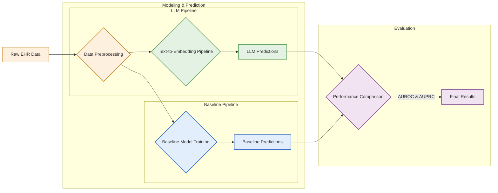

# Figure: End-to-End Experimental Workflow

```mermaid
graph LR
    %% Data Input
    A[Raw EHR Data] --> B{Data Preprocessing};

    %% Modeling Pipelines
    subgraph "Modeling & Prediction"
        direction TB
        
        subgraph "LLM Pipeline"
            B --> C{Text-to-Embedding Pipeline};
            C --> D[LLM Predictions];
        end

        subgraph "Baseline Pipeline"
            B --> E{Baseline Model Training};
            E --> F[Baseline Predictions];
        end
    end

    %% Evaluation
    subgraph "Evaluation"
        direction LR
        D & F --> G{Performance Comparison};
        G -- AUROC & AUPRC --> H[Final Results];
    end

    %% Styling
    classDef data fill:#fef0de,stroke:#c7882a,stroke-width:2px;
    classDef llm fill:#e4f2e3,stroke:#559a53,stroke-width:2px;
    classDef baseline fill:#e3eefc,stroke:#3671c6,stroke-width:2px;
    classDef eval fill:#f1e3f2,stroke:#8d559a,stroke-width:2px;

    class A,B data;
    class C,D llm;
    class E,F baseline;
    class G,H eval;
```
